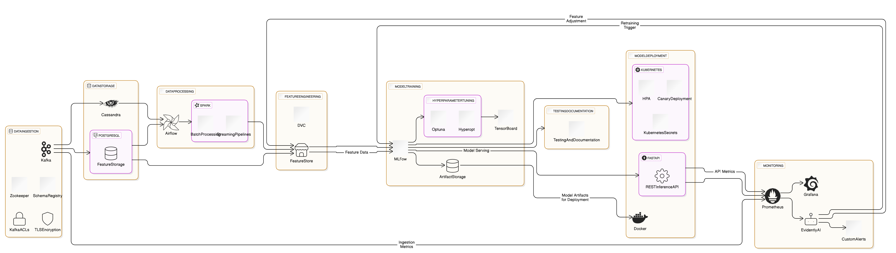

# DataScience_Pipeline

- **Data Ingestion**: Kafka, Zookeeper
- **Data Storage**: PostgreSQL, Cassandra
- **Data Processing**: Airflow, Spark
- **Feature Engineering**: DVC, FeatureStore (Feast)
- **Model Training & Tuning**: TensorFlow, MLFlow, Hyperopt
- **Monitoring & Deployment**: Prometheus, Grafana, Docker, Kubernetes

